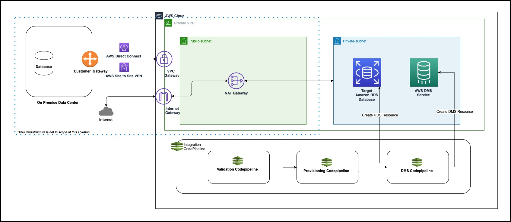
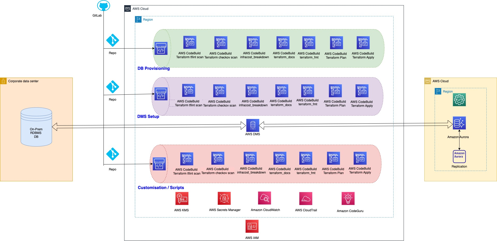

Database Migration DevOps Framework using Terraform
Overview
The Database Migration DevOps Framework (DMDF) enables customers to accelerate the migration of on-premise SQL databases to AWS using Infrastructure as Code (IaC) and CI/CD best practices. It automates key aspects of the database migration lifecycle—validation, provisioning, and data replication—leveraging AWS services like Database Migration Service (DMS), CodePipeline, CodeBuild, and Secrets Manager.

This framework eliminates manual setup and enforces DevOps principles to streamline cloud adoption and standardize database operations across environments.

Architecture Summary
Source Database: On-premise or hosted SQL database (VM, container, or other cloud platforms)

Connectivity: Secure VPN or Direct Connect between on-premise and AWS

Target Database: Amazon RDS instance provisioned via Terraform within a VPC

Replication Tool: AWS DMS replicates data from source to target

Validation Pipeline: Ensures network connectivity, credentials, and configurations are correct before proceeding

CI/CD Pipelines: Automate the following migration phases:

db-validation: Verifies source/target configuration and connectivity

db-provisioning: Provisions AWS database resources using Terraform

db-dms: Sets up DMS resources via IaC

db-cicd-integration: Orchestrates the entire process using nested pipelines

Modules & Components
Terraform Modules: Modularized templates for IAM roles, CodeBuild, CodeCommit, KMS, and S3 buckets

Custom Parameters: All configurations (via SSM Parameters) are centralized for consistency and reusability

Setup Directory: Stores and initializes all required SSM parameter values before pipeline execution

Use Case
This framework demonstrates a homogeneous database migration where an existing SQL database is migrated to Amazon RDS. Post-migration, the legacy system can be decommissioned after thorough validation.

Benefits
Automates end-to-end database migration using modern DevOps workflows

Standardizes IaC practices for database provisioning and replication

Enhances operational agility, scalability, and regional expansion

Reduces human error and manual intervention

Integrates seamlessly with existing CI/CD tools for continuous improvement

Offers cost optimization by leveraging pay-as-you-go AWS services

Limitations
Supports homogeneous database migrations only (e.g., SQL to SQL on RDS)

Does not currently support heterogeneous migrations (e.g., Oracle to PostgreSQL)
